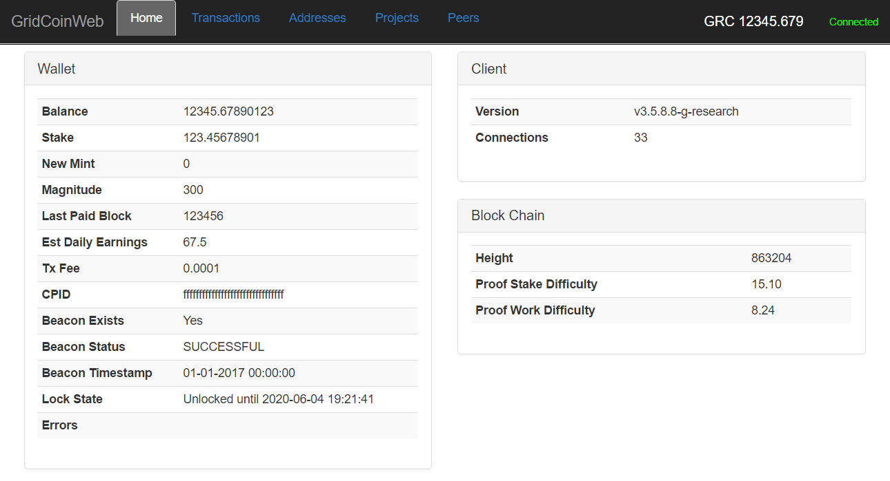

gridcoinweb
===========
**gridcoinweb** is a monitor application for monitoring your
[gridcoin wallet](https://gridcoin.us). **gridcoinweb** is written in Python
and Javascript using flask, bootstrap and jquery.

You might wonder why **gridcoinweb** exists since the wallet has a UI. If
you are thinking this, you are probably running the wallet on your local
desktop machine - so this project isn't for you.

However, if, like me, you are running the wallet on a headless Linux server,
**gridcoinweb** gives a nice, simple, web interface for monitoring your wallet,
and is nicer than manually typing RPC commands and decoding the JSON.

**gridcoinweb** refreshes its data every 30 seconds, so you can keep it
running and it updates automatically.



Note that **gridcoinweb** is developed independently from gridcoin and is not
an official gridcoin project. I built it because it is useful to me, but other
people in the gridcoin community might find it useful as well. This project
can be as official or not as the gridcoin community chooses it to be. :-)

Features
========

As of today, **gridcoinweb** can do the following:
* Monitor general state of your wallet, client, and the chain (see the
screenshot).
* Show the last 10 transactions, with an additional detail pane that also
links out to the address and tx explorer at gridcoinstats.eu.
* Show your addresses, with links out to the address explorer at
gridcoinstats.eu.
* List your BOINC projects and RAC, with links out to boinc.netsoft-online.com
stats.
* Show all connected peers, inbound and outbound with additional detail pane.

Please feel free to help me add more features - contributions are great, and I
welcome project collaborators.

Status
======
Still very much a work in progress. Keep an eye on the issues list for the
project, and please feel free to contribute.

Having said that, it works great and I've been using it daily since I've had
it running.

The data displayed in this application is not at parity with the gridcoin UI -
pull requests are appreciated and accepted! There's a lot of data available in
the [RPC API](http://wiki.gridcoin.us/RPC_commands). It's also worth noting
that the goal of this project is **not** to replicate all functionality
available in the main UI.

There's a horribly minimal (read: nearly nonexistent) level of exception and
error handling, logging, and feedback. This needs to be vastly improved.

Dependencies
============
**gridcoinweb** has been developed and tested on Debian Linux, but should
work anywhere the necessary Python packages are available (it has been tested
inside Windows 10 Bash/WSL). It will work with either Python 3 or 2.7.

**gridcoinweb** requires the following dependencies:

* flask - (python3-flask or python-flask Debian package)
* requests - (python3-requests or python-requests Debian package)

Bundled versions of [bootstrap](http://getbootstrap.com) and
[jquery](http://jquery.com) are included.

Usage
=====

As a flask application, **gridcoinweb** should really be run with a WSGI
container such as gunicorn, however for development/testing purposes you can
use the built-in flask development server via the "run" script provided
(edit to use python 2.7 instead of python 3 if required).

I've just been using the development server myself, personally, and it works
well enough - certainly well enough to give this a try!

```
usage: server.py [-h] [-p PORT] [-l LISTEN] [-d] [-g HOST] [-u USER]
                 [-a PASSWD]

Development server

optional arguments:
  -h, --help            show this help message and exit
  -p PORT, --port PORT  Port for HTTP server (default=8000).
  -l LISTEN, --listen LISTEN
                        Listen interface for HTTP server (default=127.0.0.1).
  -d, --debug           Debug mode.
  -g HOST, --host HOST  gridcoind RPC host:port (default=localhost:15715).
  -u USER, --user USER  gridcoind RPC auth username.
  -a PASSWD, --passwd PASSWD
                        gridcoind RPC auth passwd.
```

Example:

Start the development server:
```
$ ./run -u rpcuser -a rpcpassword
Starting server on port 8000 with debug=False
 * Running on http://127.0.0.1:8000/ (Press CTRL+C to quit)
```

Then, connect with your browser to http://localhost:8000.

Setting rpcuser and rpcpassword is optional but recommended.

Security
========

How can you trust that **gridcoinweb** won't steal your GRC or do bad things?
Honestly, you can't if you just download and run it without looking at it. As
**gridcoinweb** gains some community momentum and trust this will be less of
an issue, but **please** look at the source code so you can see what this app
does - such as the exact RPC calls it makes to your wallet.

**gridcoinweb** should be run on the host where your gridcoin wallet is running.
Running it across the network poses a security risk - please don't do this!

The data passed between your browser and **gridcoinweb** is not secured and
contains sensitive information that is sent in plain text. This is a security
risk and could result in theft of your data and/or wallet. Don't run this on
an open network out of your control, and for the love of Pete don't run this
across the public internet without some sort of secure tunnel.

Well then, how do you use **gridcoinweb** if it's so insecure? That's not hard -
run **gridcoinweb** on the same host as the wallet, then use an SSH tunnel
from your desktop machine with the browser.

* First up, start the gridcoinweb server as illustrated above on the system
running gridcoinresearchd.

* Second, ssh from the machine where you'll start your browser, tunneling port
15715 like this (this works from Windows 10 just fine, using Bash/WSL. I assume
putty and other SSH clients support port forwarding also, but they have not
been tested by me. Create a github issue if you have success/failure):

```
$ ssh -L 15715:localhost:15715 REMOTE_SERVER
```

* Finally, browse to http://localhost:8000.

License
=======

This project is licensed under a GNU General Public License GPLv3 license.
See the LICENSE file in the source repository and/or distribution.

This project includes the following files which are the properties of their
respective owners:

* js/bootstrap.min.js - [bootstrap](http://getbootstrap.com)
* css/bootstrap.min.css - [bootstrap](http://getbootstrap.com)
* js/jquery.min.js - [jquery](https://jquery.com)

**gridcoinweb** is developed independently from gridcoin and is not
an official gridcoin project.

This software is provided free and with no warranty - users accept all risk
of using it.
